# NOTES

## 说明

图片功能没有添加

textarea 不能添加图片

如果找到其他办法再更新

-----

已经能够加入图片了

## 注册界面

界面如下

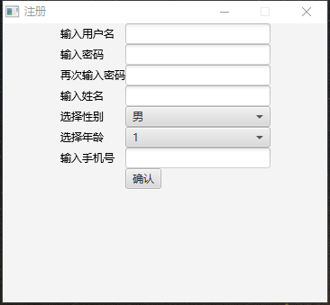

会进行简单判断要确定注册信息的合法性

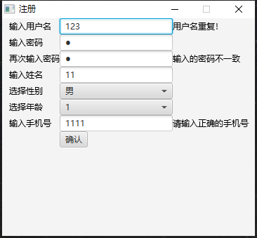

普通用户测试用例

用户名 4，

密码 4，

## 管理员注册界面

管理员需要用到另一个界面去注册，

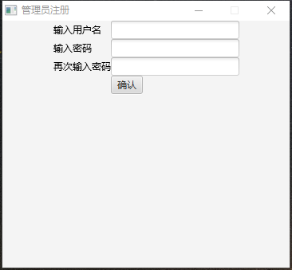

管理员测试用例

用户名

1

密码

1

## 用户界面

登录成功后

### 公告栏

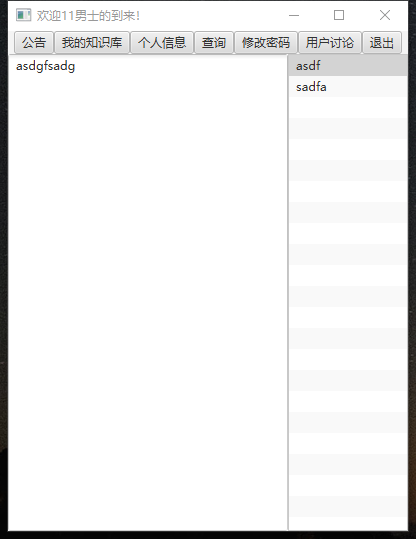

## 个人信息

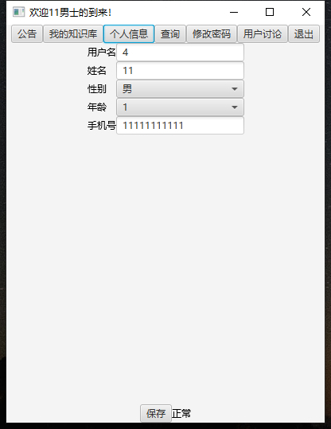

修改个人信息后要记得保存

如果是黑名单用户，个人信息最下面的正常二字会变成黑名单用户

### 查询

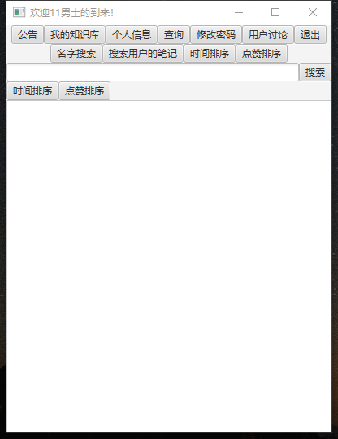

在另一个用户2中有一个公开知识库和不公开知识库，分别有两个公开和不公开的笔记，为21，22，11，12，查询只能查到21

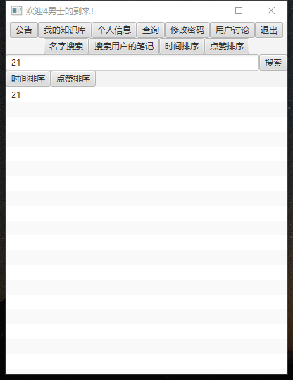

其余是查不到的

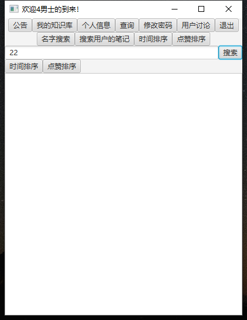

搜素用户2，也只能查到21笔记

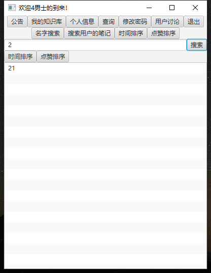

点击下面的时间排序和点赞排序可以将得到的笔记按照这些重新排序

## 密码修改

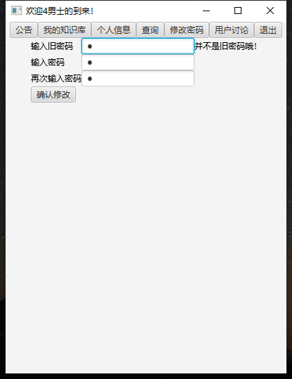

也会有一些简单的判断

否则无法更改

## 用户讨论界面

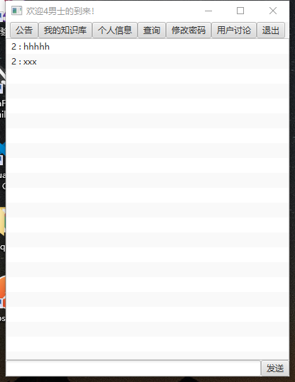

可以发送想要的评论

点击评论可以对评论回复

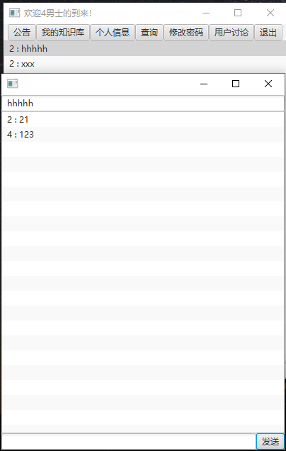

如果回复想要删除，点击自己的回复，会显示删除按钮，就可以删除了

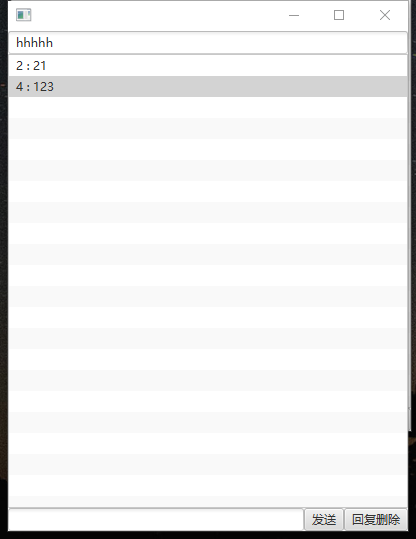

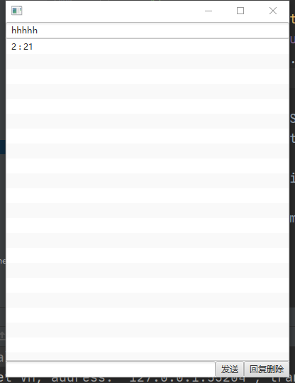

评论同理

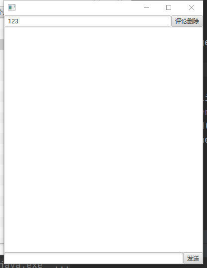

## 我的知识库

### 知识库，组的建立

可以自己建立知识库，知识库中的组，删除，修改，点击下面对应的按钮即可，

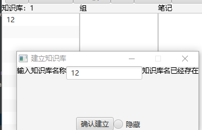

不可建立自己已经有了的知识库，组名哦

### 笔记的建立

建立知识库和组之后可以新建一个笔记

点击增加按钮即可

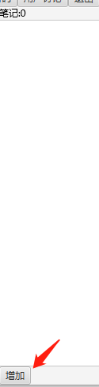

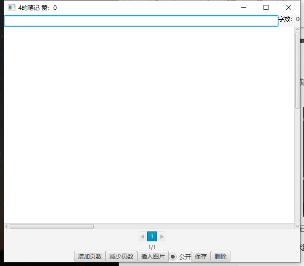

#### 图片的增加

点击插入图片按钮，选择图片就可以将想要插入的图片插入

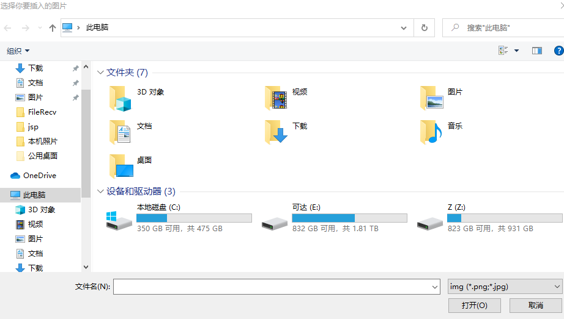

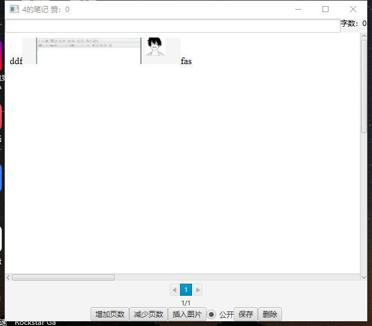

可以对图片选中之后剪贴，将光标指向任意位置再粘贴就可以把图片放入任何位置

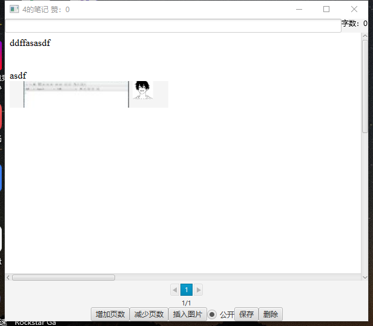

#### 页数

作者可以自由控制页数

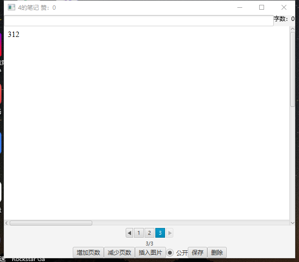

点击增加和减少页数的按钮即可

#### 公开

点击底部公开的小按钮就可以对笔记选择公开或者不公开

#### 保存

修改完，记得要保存

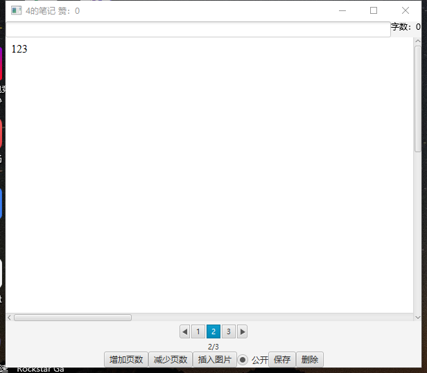

#### 字数

保存后就可以看到笔记的所有字数了

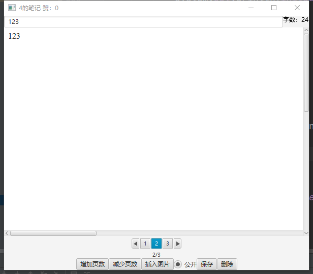

# 管理员界面

### 公告

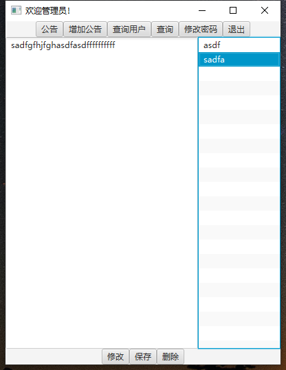

公告点击修改后就可以对公告进行公告的修改

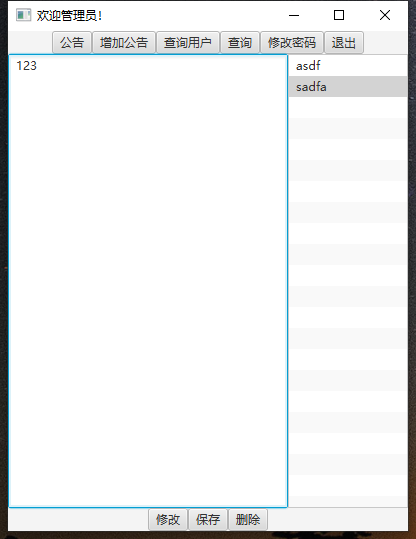

点击保存后修改完成

也可以进行删除

### 公告的增加

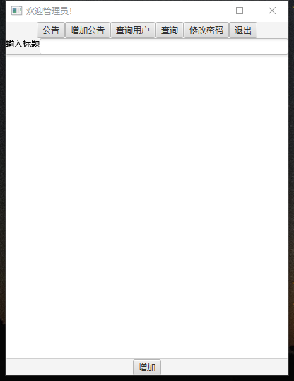

输入标题和文本，点击增加按钮后就可以增加公共了

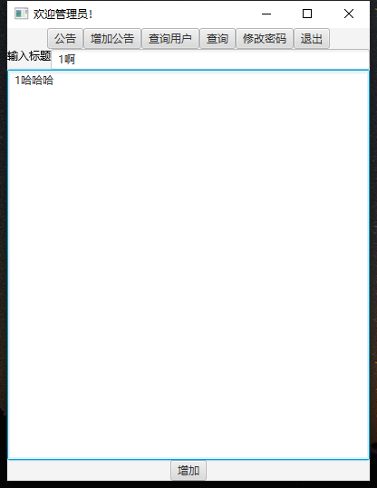

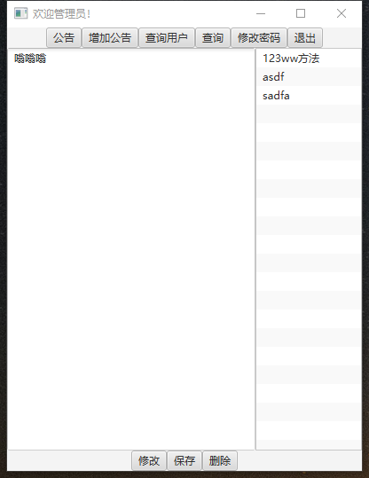

### 查询

可以查询所有用户，所有笔记

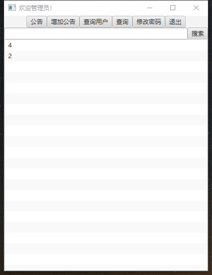

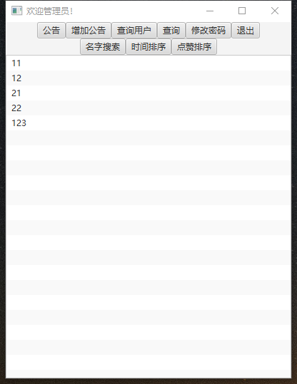

### 修改密码

与普通用户一致

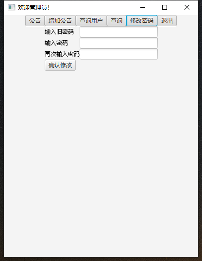

### 用户个人信息查看

用户查询后可以打开用户的信息卡

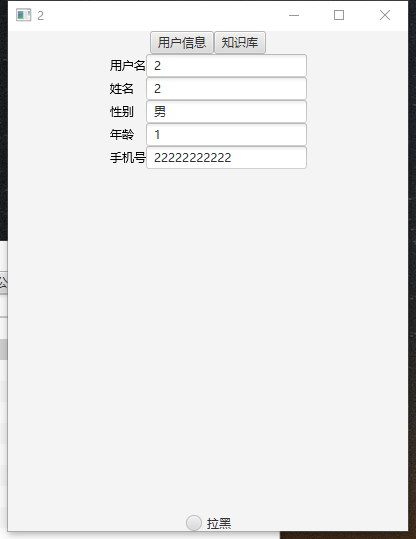

当然可以在笔记查看页面打开用户的信息卡

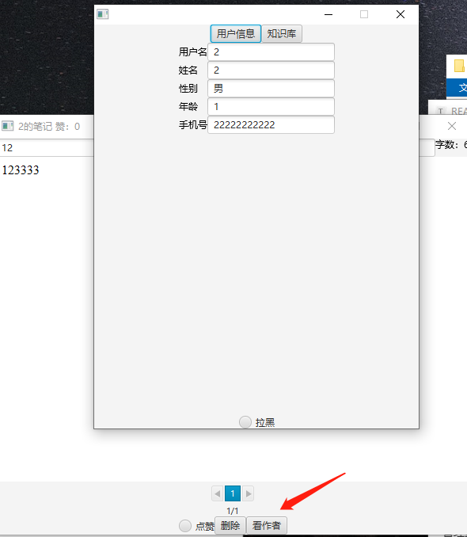

可以看到个人信息，也可以看到知识库

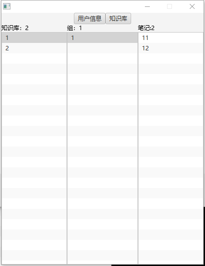